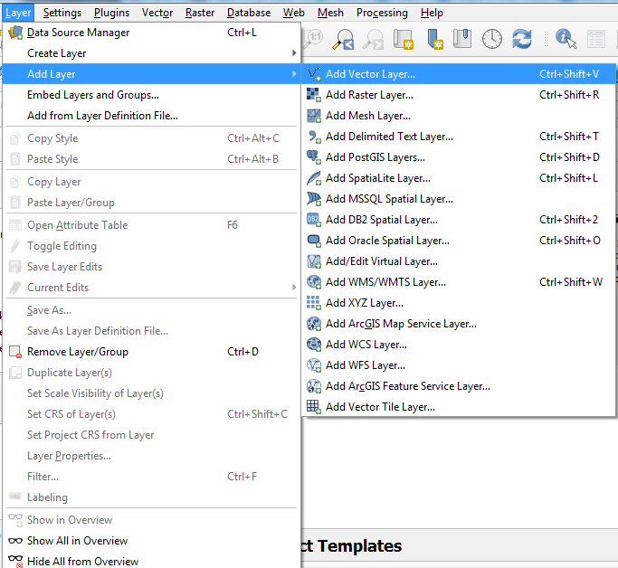

## הקדמה לקורס

קורס זה מיועד למקצע את עובדות חברת ארא בשימוש בqgis.

### קצת על עצמי

עדו קליין, 37, נשוי להילה, אב ל4.

חיפאי במקור, ירושלמי בהווה.

בעל תואר ראשון בפילוסופיה, כלכלה ומדעי המדינה מהאוניברסיטה העברית (2009-2012), תואר שני בגאוגרפיה ותכנון עירוני מהאוניברסיטה העברית (2012-2014) , ותואר שלישי בגאוגרפיה מאוניברסיטת בן גוריון בנגב (2014-2018).

בוגר תכנית ממשק של האגודה הישראלית לאקולוגיה, התמחות במשרד התחבורה תחת שי קדם, כיום משנה למנכ"ל. 

כיום יועץ למשרד התחבורה בנושא מודלים ואיסוף מידע תחבורתי, ויועץ לצוות אב לתחבורה ירושלים במסגרת התכנית האסטרטגית למתע"ן. 


## מערך הקורס - מתחילים:

-   בסיס

    -   סוגי שכבות

    -   סוגי קבצים

    -   טעינת שכבות

    -   עבודה בפרויקט

-   סימבולוגיה

    -   פאנל הסגנון

    -   סוגי סימבולוגיה

    -   תגיות

    -   יצירת מפה

-   ניתוח נתונים בסיסי

    -   טבלת הישויות

    -   בחירה

    -   שאילתות טבלאיות

    -   שאילתות מרחביות

-   עריכת נתונים

    -   דיגיטציה

    -   עריכת טבלאות

-   מניפולציה מרחבית

    -   פונקציות מרחביות

    -   model builder

-   מקורות מידע לתכנון תחבורה

    -   אתרים

    -   סרויסים

    -   שו"תים


## מערך הקורס - מתקדמים:

-   פלאגינים

-   הורדת מידע מOSM


## מהו GIS

מערכת מידע גאוגרפית - מערכת ששומרת על מידע מרחבי בצורה מסודרת, ומאפשרת את עיבודו, ניתוחו, הצגתו, יצירתו וניהולו.

## סוגי מידע גאוגרפי

ישנם שני סוגי מידע גאוגרפי מרכזיים:

-   מידע רסטרי

    {width="400"}\

-   מידע וקטורי{width="400"}

בקורס זה ניגע כמעט ורק במידע וקטורי.

## סוגי מידע וקטורי

כשאנו מתעסקים עם מידע וקטורי, אני מתעסקים עם שלושה סוגים מרכזיים של ישויות:

-   נקודות\
-   קווים\
-   פוליגונים

את כל אחת מהסוגים האלה ניתן לייצג על ידי רצף של קואורדינטות:

```{r message=FALSE, warning=FALSE, include=FALSE}
library(sf)
library(tidyverse)
library(todor)
library(downloadthis)
Sys.setlocale(locale = "hebrew")
```

```{r point, echo=FALSE, message=FALSE, warning=FALSE}
p <- st_point(c(5,5)) %>% st_sfc() %>% st_sf()
ggplot(p) + geom_sf() + labs(title = "נקודה ב5,5") + theme(plot.title = element_text(hjust = 0.5))
```

```{r line, echo=FALSE, message=FALSE, warning=FALSE}
p <- st_linestring(matrix(c(5,4,5,4),ncol=2)) %>% st_sfc() %>% st_sf()
ggplot(p) + geom_sf() + labs(title = "קו מ5,5 ל4,4") + theme(plot.title = element_text(hjust = 0.5))
```

```{r polygon, echo=FALSE, message=FALSE, warning=FALSE}
p <- st_polygon(list(matrix(c(5,5,4,4,4,5,5,5),ncol=2, byrow=TRUE))) %>% st_sfc() %>% st_sf()
ggplot(p) + geom_sf() + labs(title = "פוליגון מ5,5 ל4,4 ל4,5 ל5,5") + theme(plot.title = element_text(hjust = 0.5))
```

## מידע וקטורי - שם מפוצץ לטבלה

אך לפני זה, חשוב להבין שgis הוא פשוט טבלה מלאה במידע, שלפחות אחת מעמודות הטבלה מכילה מידע גאוגרפי,כמו בטבלה הזאת:

| מזהה |    שם | גיל | מיקום |
|-----:|------:|----:|------:|
|    1 | אביעד |  65 |   1,1 |
|    2 |   רפי |  23 | 26,41 |
|    3 |  ניסן |  32 | 31,82 |
|    4 | אביאל |  74 | 93,49 |

מכיוון שחלק מהמידע הגאומטרי הוא מסובך לקידוד, בהתחשב בהיטלים הגאוגרפיים ובמורכבות הישות, הוספה של עמודת הגאומטריה לטבלה לא מועילה (אך בפלטפורמות אחרות, כמו R או POSTGIS, היא מופיעה).

בשכבה זו, לצורך העניין, יש ארבע ישויות שונות, כאשר כל ישות מסמלת נקודה אחת.\

```{r map_is_a_table, echo=FALSE, message=FALSE, warning=FALSE}
data.frame(id = c(1,2,3,4),
           name = c("אביעד","רפי","ניסן","אביאל"),
           age = c(65,23,32,74),
           geom = st_sfc(st_point(c(1,1)),
                         st_point(c(26,41)),
                         st_point(c(31,82)),
                         st_point(c(93,49)))) %>% 
  st_as_sf() %>% 
  ggplot(aes(label = paste("מזהה:",id,"\nשם:",name,"\nגיל:",age))) + 
  geom_sf_label()
```

## מימדים נוספים במידע וקטורי

מעבר לסוגי הישויות, קיימים היבטים נוספים עבור כל ישות:

-   ישות מרובה צורות - ישות אחת יכולה להכיל מספר נקודות/קווים/פוליגונים\

```{r multipoint, echo=FALSE, message=FALSE, warning=FALSE}
data.frame(id = 5,name = "שלמה", age = 34,geom = st_sfc(st_multipoint(matrix(c(1,1,2,2,3,3),ncol=2,byrow = T)))) %>% 
  st_as_sf() %>% 
  st_cast("POINT") %>% 
  ggplot(aes(label = paste("מזהה:",id,"\nשם:",name,"\nגיל:",age))) + 
  geom_sf_label() + 
  geom_sf()
```

-   תלת מימד - ניתן להוסיף לקוארדינטות מימד גובה

שוב, נזכיר - שכבה היא בעצם טבלה עם גאומטריה, וכמו שעל עמודה בטבלה ניתן לבצע פעולות חישוביות, כך גם על ישויות,ועל כך נרחיב בהמשך הקורס.

## סוגי קבצים

ניתן לחלק את סוגי הקבצים לשניים:

-   קבצים בודדים

-   חבילות קבצים

## קבצים בודדים[1]

#### shapefile (.shp and more)

הshp, פורמט שייצרה חברת esri, מכיל מספר קבצים שכאשר נמצאים באותה תיקיה, יוצרים אפשרות לצפות בישויות שונות, תחת מגבלות מסוימות:

-   הפורמט זקוק ללפחות שלושה קבצים על מנת לפעול(צורות מרחביות, מאגר נתונים מרחבי ואינדקס מרחבי, ובדרך כלל ליותר מכך
-   עמודה מכילה סוג גאומטריה אחד בלבד
-   יש עמודת גאומטריה אחת בלבד

 בזמנכן הפנוי - היטלים ומערכת קואורדיטות:

[הסבר קליט](https://www.youtube.com/watch?v=kIID5FDi2JQ)

[מצגת של הראל דן על ההקשר הישראלי - חשוב להכיר](https://kaplanopensourceconsulting.files.wordpress.com/2019/06/d7a8d7a9d7aa-d799d7a9d7a8d790d79c-d794d797d793d7a9d794-d791d7a1d791d799d791d795d7aa-d7a7d795d793-d7a4d7aad795d797-d79bd7a0d7a1-d7a7d795d793-d7a4d7aad795d797-2019-d794d7a8d790d79c-d793d7.pptx)

## הדגמה של טעינת שכבות ועבודה בסיסית


## תרגיל ראשון:
```{r echo=FALSE}
download_file("tlv_struc_fin.zip",button_label = "להורדת הקובץ")
```

1.  הורידו את קובץ הshp מהקישור למעלה, אנזפו וטענו אותו

2.  שימו לב שהשכבה נכנסה ללשונית השכבות

3.  טענו את שכבת הרקע של osm

4.  השתמשו בכפתורי סרגל הניווט. אל תתביישו להתנסות

5.  פתחו את טבלת הפיצ'רים וחקרו אותם

6.  ענו על השאלות הבאות:\

    1.  כמה בניינים יש בשכבה?

    2.  באיזה רחוב נמצא הבניין העתיק ביותר?

    3.  באיזה רחוב נמצא הבניין הצפוני ביותר?

## קבצים בודדים[2]

#### .geojson 

פורמט המייצג גאומטריות בפורמט json לשמירת נתונים, מכיל רק נתונים המתאימים לרשת גאוגרפית wgs84.

כפי שניתן לראות, הנתונים בgeojson הינם טקסטואלים, מה שאומר שניתן לפתוח אותם בכל עורך טקסט ולצפות או לשנות אותם משם, זת בניגוד לקבצי שייפ המבוססים על מבנה נתונים שלא קריא לבני אדם.


## תרגיל שני:
```{r echo=FALSE}
download_file("water.geojson",button_label = "להורדת הקובץ")
```

1.  טענו את הקובץ, שימו לב למיקום הנקודות, בחרו את הנקודה הצפונית ביותר ורשמו את המזהה שלה. הסירו את השכבה
2.  פתחו את הקובץ בnotepad, הזיזו את הנקודה דרומה, שמרו את הקובץ
3.  טענו מחדש את השכבה וצפו בהבדל

## קבצים בודדים[3]

#### .csv

ניתן לטעון קובץ טבלאי רגיל, באחת משלוש דרכים:

1.  על ידי ציון קואורדינטות - עמודות המייצגות קו אורך וקו רוחב - מאפשר טעינה של נקודות בלבד

2.  עמודה המציינת wkt - מאפשר טעינה של כל סוגי הגאומטריה הנתמכים על ידי wkt

3.  על ידי אי ציון גאומטריה. משמש בעיקר לחיבורים טבלאיים

## תרגיל שלישי:

```{r echo=FALSE}
download_file("schools.csv",button_label = "להורדת הקובץ")
```


2.  טענו אותו:

3.  דגשים: לדעת איזה שדות להכניס לx וy, לדעת איזה מערכת קואורדינטות לבחור (בתשעה מתוך 10 מקרים של מידע ישראלי, זאת תהיה רשת ישראל החדשה, שהסימון שלה בepsg הוא 2039), ולבסוף - במידה והעברית מתחרבשת - לשחק עם הencoding. לרוב או utf8 או windows1255

## חבילות קבצים[1]

#### geodatabase (.gdb)

פורמט של חברת esri לאריזת שכבות בבסיס נתונים מקומי.

בפועל, תיקייה המכילה סוגים רבים של קבצים, שמהווים את כלל השכבות (או הטבלאות) שנשמרו בה.

לרוב לא תתקלו בתיקיה זו, לטעון אותה לqgis זה לעיתים מעצבן. 

## אתנחתא - פרויקטים

סביבה המאפשרת שמירה של היבטים מסוימים בתוכנה, כמו - סימבולוגיה, סדר שכבות, מקורות מידע חיצוניים, מודלים, סוגי הדפסות ועוד.

במידה ועובדים שלא בפרויקט, יש צורך לשמור על כל אחד מקבצים אלו בנפרד. הפרויקט אוגד אותם לכדי קובץ אחד.

עם זאת, במידה ומשתמשים בפרויקט בצורה של קבצים בודדים, יש צורך בשחזור מדויק של סביבת העבודה, עם כל ההפניות לקבצים. זה עלול לגרום לכאב ראש גדול מאוד

## חבילות קבצים [2]

#### geopackage(.gpkg)

בסיס נתונים מרחבי, בדומה לGDB, אך שונה ממנו בכמה היבטים:

-   קובץ אחד בלבד, לא תיקיה

-   מאפשר שמירת פרויקטים בתוך בסיס הנתונים

-   מהווה בסיס נתונים מקומי אליו ניתן לגשת באמצעות כל תוכנה התומכת בקריאת בסיס נתונים מרחביים ממשפחת sqlite

יש לציין שכל היכולות הללו קיימות גם מול בסיסי נתונים כמו postgresql יחד עם ההרחבה postgis, אבל דורשים גם הרבה יותר קונפיגורציה למחשב, כמו התקנת התוכנה המריצה את בסיס הנתונים על המחשב. עם זאת, היא מאפשרת עבודה במקביל מול מקורות מידע מתעדכנים - פחות רלוונטי לאדריכלות)הדגמה של אי נוחות עבודה בפרויקט מרובה קבצים, אל מול גאופקג'

## תרגיל רביעי:
```{r echo=FALSE}
download_file("project.qgz",button_label = "להורדת הקובץ")
```
1.  פתחו את הפרויקט(סיומת qgz) שנמצא בתיקית lesson_1 בקובץ הזיפ. בהנחה שאף קובץ לא זז מהתיקיה, הפרויקט אמור לעלות.

2.  פתחו פרויקט חדש. במנהל הקבצים, הוציאו את אחת השכבות האחרות מהספריה בה נמצא קובץ qgs. פתחו את הפרויקט מחדש. 

## פתיחת פרויקט בתוך חבילה

על מנת להימנע מהמקרה הזה, ניתן לשמור על הכל - קבצים ופרויקט - בתוך קובץ gpkg אחד.

דרך זו גם מקילה על איגוד הקבצים, גם מאפשרת שמירה על סגנונות של שכבות מחוץ לפרויקט, אותם ניתן לייבא ולייצא בקלות, וגם מאפשר שמירה מסודרת של קבצים שונים לחלוטין, כמו תמונות, בתוך בסיס הנתונים המקומי, כל עוד אלה יכולים להיות מבוטאים כblob

(binary large object). עבור מתכננים, שעובדים על פרויקט בכל פעם ועם בסיסי נתונים קטנים יחסית, האפשרות ליצור בסיס נתונים מקומי יכולה לשפר מאור את תהליך העבודה.

## תרגיל חמישי:
```{r echo=FALSE}
download_file("project.gpkg",button_label = "להורדת הקובץ")
```
1.  פתחו את מנהל מקורות המידע

2.  התחברו לgpkg שהורדתן

    

## אריזת שכבות לgpkg

1.  processing toolbox -\> package layers

    

2.  בחרו את כל השכבות שתרצו לארוז

    

3.  יצאו למקום שאתם זוכרים היכן הוא

## הוספת הפרויקט לgpkg

1.  בחרו בsave to

2.  חברו את הקובץ המבוקש, תנו לפרויקט שם

## טעינת הפרויקט מתוך gpkg

1.  בחרו בbrowser בלשונית goepackage

2.  ודאו כי הקובץ מחובר, במידה ולא הוסיפו אותו עם new connection

3.  ניתן לפתוח את הפרויקט על ידי לחיצה כפולה על הסמל שלו

## תרגיל שישי:

1.  טענו את השכבות ישירות מהקבצים

2.  ארזו אותם לגאופקג'

3.  שמרו אותם בפרויקט בתוך הגאופקג'

4.  טענו את הפרויקט מתוך הגאופקג'

<link href="my-style.css" rel="stylesheet">
