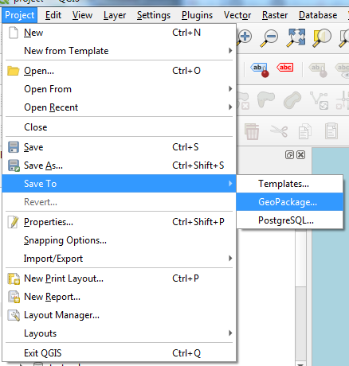
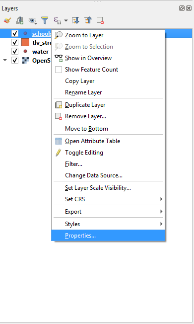
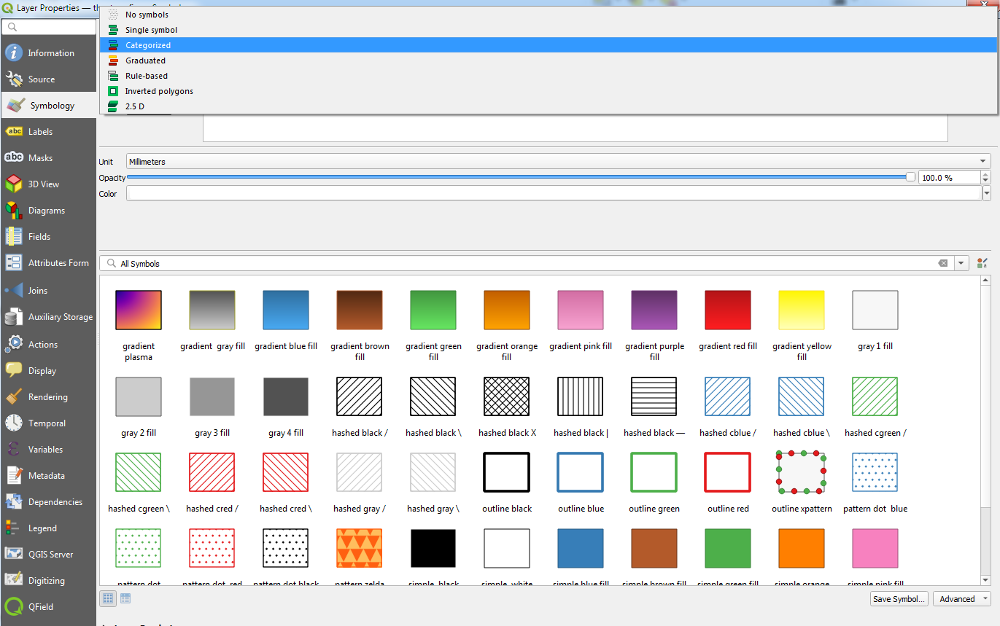
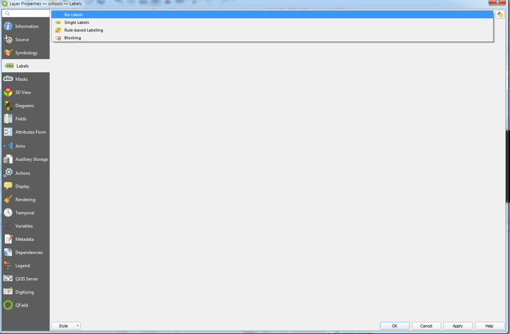
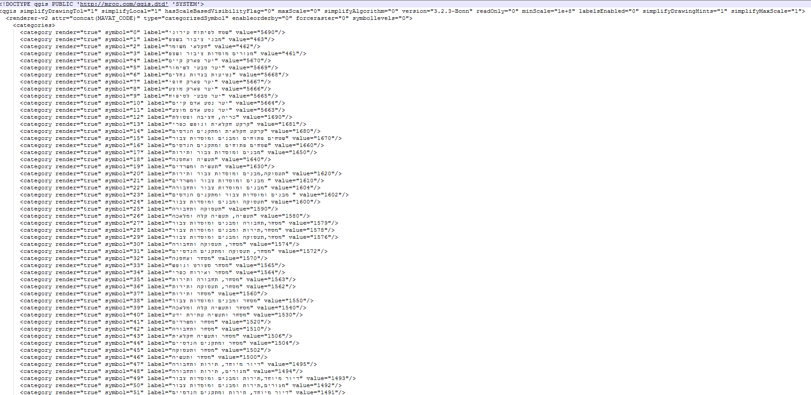

```{r include=FALSE}
pacman::p_load(tidyverse,downloadthis,sf,ggpattern)
```

## חבילות קבצים[1]

### geodatabase (.gdb)

פורמט של חברת esri לאריזת שכבות בבסיס נתונים מקומי.

בפועל, תיקייה המכילה סוגים רבים של קבצים, שמהווים את כלל השכבות (או הטבלאות) שנשמרו בה.

לרוב לא תתקלו בתיקיה זו, לטעון אותה לqgis זה לעיתים מעצבן. 

## אתנחתא - פרויקטים

סביבה המאפשרת שמירה של היבטים מסוימים בתוכנה, כמו - סימבולוגיה, סדר שכבות, מקורות מידע חיצוניים, מודלים, סוגי הדפסות ועוד.

במידה ועובדים שלא בפרויקט, יש צורך לשמור על כל אחד מקבצים אלו בנפרד. הפרויקט אוגד אותם לכדי קובץ אחד.

עם זאת, במידה ומשתמשים בפרויקט בצורה של קבצים בודדים, יש צורך בשחזור מדויק של סביבת העבודה, עם כל ההפניות לקבצים. זה עלול לגרום לכאב ראש גדול מאוד

## חבילות קבצים [2]

#### geopackage(.gpkg)

בסיס נתונים מרחבי, בדומה לGDB, אך שונה ממנו בכמה היבטים:

-   קובץ אחד בלבד, לא תיקיה

-   מאפשר שמירת פרויקטים בתוך בסיס הנתונים

-   מהווה בסיס נתונים מקומי אליו ניתן לגשת באמצעות כל תוכנה התומכת בקריאת בסיס נתונים מרחביים ממשפחת sqlite


## תרגיל ראשון:
```{r echo=FALSE}
download_file("project.qgz",button_label = "להורדת הקובץ")
```
1.  פתחו את הפרויקט(סיומת qgz) שנמצא בתיקית lesson_1 בקובץ הזיפ. בהנחה שאף קובץ לא זז מהתיקיה, הפרויקט אמור לעלות.

2.  פתחו פרויקט חדש. במנהל הקבצים, הוציאו את אחת השכבות האחרות מהספריה בה נמצא קובץ qgs. פתחו את הפרויקט מחדש. 

## פתיחת פרויקט בתוך חבילה

על מנת להימנע מהמקרה הזה, ניתן לשמור על הכל - קבצים ופרויקט - בתוך קובץ gpkg אחד.

דרך זו גם מקילה על איגוד הקבצים, גם מאפשרת שמירה על סגנונות של שכבות מחוץ לפרויקט, אותם ניתן לייבא ולייצא בקלות, וגם מאפשר שמירה מסודרת של קבצים שונים לחלוטין, כמו תמונות, בתוך בסיס הנתונים המקומי, כל עוד אלה יכולים להיות מבוטאים כblob (אם זה נשמע כמו יידיש - עמכם הסליחה. בלוב זה פשוט דרך לייצג נתונים)

(binary large object). עבור מתכננים, שעובדים על פרויקט בכל פעם ועם בסיסי נתונים קטנים יחסית, האפשרות ליצור בסיס נתונים מקומי יכולה לשפר מאור את תהליך העבודה.

## תרגיל שני:
```{r echo=FALSE}
download_file("project.gpkg",button_label = "להורדת הקובץ")
```
1.  פתחו את מנהל מקורות המידע

2.  התחברו לgpkg שהורדתן


## אריזת שכבות לgpkg

1.  processing toolbox -\> package layers


2.  בחרו את כל השכבות שתרצו לארוז


3.  יצאו למקום שאתם זוכרים היכן הוא

## הוספת הפרויקט לgpkg

1.  בחרו בsave to

2.  חברו את הקובץ המבוקש, תנו לפרויקט שם

## טעינת הפרויקט מתוך gpkg

1.  בחרו בbrowser בלשונית goepackage

2.  ודאו כי הקובץ מחובר, במידה ולא הוסיפו אותו עם new connection

3.  ניתן לפתוח את הפרויקט על ידי לחיצה כפולה על הסמל שלו

## תרגיל שלישי:

1.  טענו את השכבות ישירות מהקבצים

2.  ארזו אותם לגאופקג'

3.  שמרו אותם בפרויקט בתוך הגאופקג'

4.  טענו את הפרויקט מתוך הגאופקג'

# סימבולוגיה

## סוגי ייצוג של ישויות

לפני שמתחילים לייצג תופעה מרחבית, נשאל את עצמנו שתי שאלות בסיסיות:

1.  מהו אופי המשתנה המיוצג?

2.  מהו אופי הייצוג?

## אופי המשתנה

-   נומינלי(שמות, מין) - אין חשיבות לסדר
-   אורדינלי(רמות הכנסה, השכלה) - יש חשיבות לסדר, אין רציפות
-   אינטרבלי(טמפרטורה) - יש חשיבות לסדר, יש רציפות, אין יחסיות
-   יחסי(נפחי תנועה) - יש חשיבות לסדר, יש רציפות, יש יחסיות

## אופי הייצוג

-   צבע

```{r echo=FALSE, message=FALSE, warning=FALSE, cache=TRUE}
nc <- st_read(system.file("shape/nc.shp", package="sf"),quiet = TRUE)
nc %>% 
  st_centroid() %>% 
  ggplot(aes(color = SID79)) + 
  geom_sf()
```

-   גודל

```{r echo=FALSE, message=FALSE, warning=FALSE, cache=TRUE}
nc %>% 
  st_centroid() %>% 
  ggplot(aes(size = SID79)) + 
  geom_sf()
```

-   צורה

```{r echo=FALSE, message=FALSE, warning=FALSE, cache=TRUE}
nc %>% 
  st_centroid() %>% 
  ggplot(aes(shape = factor(floor(SID74/8)))) + 
  geom_sf()
```

-   מילוי

```{r echo=FALSE, message=FALSE, warning=FALSE, cache=TRUE}
nc %>% 
  ggplot(aes(pattern =  factor(floor(SID74/8)))) + 
  geom_sf_pattern()
```

-   שקיפות

```{r echo=FALSE, message=FALSE, warning=FALSE, cache=TRUE}
nc %>% 
  st_centroid() %>% 
  ggplot(aes(alpha = factor(floor(SID74/8)))) + 
  geom_sf()
```

-   מרקם קו

```{r echo=FALSE, message=FALSE, warning=FALSE, cache=TRUE}
nc %>% 
  ggplot(aes(linetype =factor(floor(SID74/8)))) + 
  geom_sf()
```

## בqgis

שתי דרכי גישה אל פאנל העיצוב:

דרך פאנל {width="400"}


בחלון נפרד

## סימול אחיד

התוכנה מאפשרת לנו לבצע סימולים אחידים עבור כל השכבה. במידה ואנחנו לא רוצים להיכנס לפרטים, ניתן לעשות קוסטימיזציה למאפיינים בסיסיים כמו גודל, צבע, שקיפות וזווית. ניתן גם לבחור סגנון קבוע מראש.

## סימול מורכב יותר

במידה ולוחצים על simple marker, אפשר לשפר את השליטה בסימון הנקודה.


יש הרבה מאוד אפשרויות סגנון, ניתן להעלות סוגים שונים של מרקרים מתמונות וכו'. מדובר בעולם תוכן שלם, ולא ניגע בו בקורס זה, שכן הוא כולל הרבה מאוד למידה עצמית, והוא מאוד תלוי למה שרוצים להשיג.

## סימול לפי קטגוריות

נשנה את הבחירה בדרופדאון העליון לcategorized



השליטה הבסיסית כאן היא:

על בסיס איזה משתנה מחלקים לקטגוריות. qgis מציין אם המשתנה הוא מספרי או טקסטואלי, ובכך מסייע בבחירה (ניתן להשתמש בביטויים, לצערי לא נכסה זאת במסגרת הקורס)

הפיכת הסימול למורכב יותר, בדומה לסימול אחיד

רמפת צבעים


שימו לב! תמיד יש ללחוץ על כפתור הclassify על מנת לחלק לרמות השונות


ניתן להוסיף או להחסיר קטגוריות על בלחיצה על + או -, לשנות את שם התגית שתוצג בחלונית השכבות ובמקרא המפה.

## סימול לפי משתנה רציף - אוטומטי

דומה מאוד לסימון לפי משתנה קטגוריאלי, בשינוי משמעותי אחד - השליטה בחלוקה לרמות. ניתן לבצע אותה בצורה אוטומטית או ידנית:

בצורה אוטומטית, יש ללחוץ על תפריט mode (לאחר שבחרנו את המשתנה ולחצנו על classify), ולבחור את צורת החלוקה בין הנתונים.


## אפשרויות חלוקת דאטה:

1.  x-ונים - כמות שווה של דגימות בכל קבוצה (חציונים, רביעונים, חמישונים, עשירונים וכו')

2.  מרווח שווה בין הערכים (נניח שסט הערכים בין 0 ל10, ואנו מחלקים בחמש, החלוקות יהיו במספרים הזוגיים)

3.  סקאלה לוגרתמית - חלוקה שווה בין החזקות הלוגרתמיות

4.  הפסקות טבעיות - מבוססות אלגורתם jenks (ממזער שונות בתוך הקבוצה, ממקסם שונות בין הקבוצות)

5.  הפסקות יפות - מבוססות עיגול ערכים

6.  חלוקה מבוססת מיקום הדגימה בהתחשב מהסטייה של הנתון מהממוצע

כפתור הclasses מאפשר לנו לחלק את הדאטה לכמות הרמות הרצויה.

שימוש בhistogram מאפשר לנו לראות כיצד הדאטה מתפלג, ומסייע בהבנה של איך יהיה חכם לייצג אותו בצורה לא מרחבית. ניתן אף להוסיף רמות על ידי לחיצה על המקום בהיסטוגרמה בו רוצים להוסיף, או לשנות גבולות על ידי הזזת הקווים על ההיסטוגרמה. (לא לשכוח ללחוץ על load values בהתחלה)

## סימול לפי משתנה רציף - ידני

ניתן גם לחלק לרמות שונות בצורה ידנית - בחירת המשתנה, הוספת רמות באמצעות לחיצה על כפתור הפלוס, בחירה הרמה הרצויה, ודאבל קליק על עמודת הvalues. שם יש לציין גבול תחתון ועליון לרמת הייצוג. במידה ויש כמה רמות, הגבולות בין הרמה לרמות האחרות ישתנו בהתאם לשינוי שמבצעים ברמה. יש לבחור צבעים לכל רמה על ידי דאבל קליק על עמודת symbol,וגם לשנות את התגית של הקבוצה על ידי דאבל קליק על השדה בעמודת legend.

## assistant

פעמים רבות, בייצוג גדלים אבל לא רק, נוכל לעשות שימוש במשתנים שונים על מנת לייצג מימדים נוספים של המשתנה. שימוש בדיאלוג של assistant יכול לעזור בבחירת המשתנה הרלוונטי


## זה לא נגמר כאן....

סימבולוגיה היא עולם שלם ומופלא. למדנו עכשיו רק את הבסיס שלו, שמספיק ל80% מהמקרים. ב20% האחרים יש להיכנס יותר עמוק לqgis, לסמן לפי חוקים, מפות חום, שניים וחצי מימדים, גודל וכו'

הלימוד העצמי כאן חשוב מאוד, וישנם מקורות רבים באינטרנט בהם ניתן להיעזר

## תרגיל רביעי:

1.  פתחו את הפרויקט מהגאופקג' 

2.  ייצגו את המבנים בת"א לפי שנת הבנייה

3.  יצגו את בתי הספר במפה לפי הישוב בהם הם נמצאים

4.  שמרו על השינויים בפרויקט

5.  פתחו פרויקט חדש, וטענו שוב את הפרויקט

## תגיות

לעיתים נרצה לייצג את הישויות שלנו בצורה טקסטואלית על גבי המפה. נלך לטאב הlabels בproperties של השכבה. לרוב נרצה את single lables



ניתן לקבוע ערכים רבים לגבי הטקסט - המשמעותי ביותר היא העמודה או הביטוי שמייצג אותו (value). ניתן לשלוט בגודל הפונט, בסוג שלו בשקיפות וכו'. בתפריט בצד ניתן לראות עוד אפשרויות - צבע מסביב לטקסט, טקסט רומס או לא רומס, וכו'. אין כאן המקום להאריך, בעיקר מציע לשחק או לגגל. 

## גלגל ההצלה האולטימטיבי - היסטוריה של סגנונות!

קורה שמייצרים סגנון חדש לשכבה, אבל מתחרטים ולא זוכרים מה היה בסגנון הקודם.

ניתן לעקוב אחרי ההיסטוריה של הסגנונות בפאנל:

## סגנון משתחזר

לפעמים נרצה לשחזר סגנון בצורה מדויקת, בין אם זה בתוך אותה שכבה, או בין אם זה בין שכבות שונות.

## שמירה על סגנונות מרובים באותה השכבה


ושיום של הסגנון. לאחר מכן נוכל לשנות לייצר סגנון חדש, לשיים אותו, ולבחור בין השניים לפי הצורך.

## העתקת סגנון משכבה לשכבה

ניתן ללחוץ על שכבה ולהעתיק ממנה את הסגנון:


ולאחר מכן, להעביר את הסגנון לשכבה שמכילה את אותם הנתונים עם paste style, שיווצר מתחת לcopy style

## תרגיל חמישי:

```{r echo=FALSE}
download_file("mavat.gpkg",button_label = "להורדת הקובץ")
```


1.  טענו את פרויקט mavat מהגאופקג' mavat שהורדתם עכשיו

2.  שמרו על הסגנון של שכבת rehovot east

3.  העתיקו את הסגנון של שכבת mavat_plan

4.  העבירו אותו אל שכבת rehovot east

5.  שמרו על הסגנון החדש

6.  העבירו בין שני הסגנונות

## טעינת ושמירת סגנון מקובץ/לקובץ

פעמים רבות נעבוד עם דאטה שיש לו פורמט אחוד, או שיש לנו הרבה שכבות באותו פורמט. ולכן, עיצוב אחיד שנטען משכבה אחרת במקרים אלו יכול מאוד לעזור.

קבצי qml וsld יכולים לעזור לנו בסוגיה זו.

שניהם קבצים ממשפחת xml, אך בעוד sld תואם לפורמט הכללי כפי שנקבע על ידי הogc, qml מותאם ספציפית לqgis.

ככה נראה qml מבפנים

הוא למעשה מגדיר בצורה מדוקדקת את הייצוג של כל אחד מהשדות.

בשביל להעביר בצורה יותר קלה בין פלטפורמות, כדאי להשתמש בsld, אבל qml מאפשר גמישות נוספת בהגדרות של עיצוב לפי מנוע הביטויים, בו בתקווה ניגע בהמשך הקורס.

## טעינת ושמירת סגנון מקובץ/לקובץ - 2


שם יש צורך לבחור טעינה מקובץ, שמירה על כל הקטגוריות, ובחירה בקובץ הsld או הqml.

באותה צורה ניתן גם לשמור סגנון, כsld,כqml או בתוך הגאופקג' (וארחיב קצת בהמשך)

[לינק חשוב מאוד - סגנונות mavat לqgis](https://www.gov.il/he/departments/general/symbology_qgis)

## תרגיל שישי:

1.  פתחו את פרויקט mavat_no_symbology מהגאופקג'mavat.

2.  החליפו את הסימבולוגיה של השכבות לסימבולוגית mavat סטנדרטית, באמצעות הקבצים מהקישור, או במידה ואתם בוחרים בקבצים בתיקייה.

## טעינת ושמירת סגנון מgpkg

חשוב לדעת שניתן לשמור את הסגנונות שיש לנו ישירות אל תוך הgpkg,ולא לקובץ נפרד, ככה שנדע לנהל אותם בצורה של אי ריבוי קבצים, ולייצא החוצה במידה הצורך, אם רוצים להעביר לפרויקט אחר. הסגנונות נשמרים מחוץ לפרויקט, וגם אם עובדים עם גאופקג' נטול פרויקט, הם יטענו כמות שהם. חבל שמינהל התכנון לא מפרסם את כל קצבי הmavat כגאופקג'.

## המלצה ארגונית חמה

בפרויקטים משתחזרים עתידיים, לייצר סגנונות ארגוניים קבועים לשכבות מסוימות. ברוב המקרים הם יתאימו. לעיתים תצטרכו לעשות קצת התאמות, אבל יהיה לכם בייסליין קל.


<link href="my-style.css" rel="stylesheet">


