```{r include=FALSE}
pacman::p_load(downloadthis)
```


## עריכה טבלאית

לעיתים נרצה לערוך את הערכים בשכבה, בין אם לשנות ערכים קיימים, בין אם למחוק שורות או עמודות (לא מומלץ), בין אם להוסיף שורות או עמודות חדשות. בשיעור היום נלמד איך עושים את זה.

## כניסה למצב עריכה

בqgis עורכים שכבה אחת בכל פעם. כניסה למצב עריכה נעשית באחת משלוש דרכים:

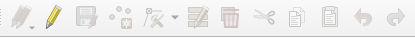

(פאנל עריכה)ולחיצה על העיפרון

או 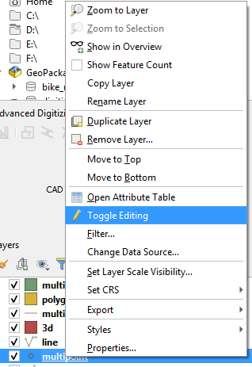

או

## ידנית - תאים

פשוט מאוד - דאבל קליק על התא, כתיבת ערך אחר, ולחיצה מחוץ לתא.

על מנת לשמור שינוי, ישנן שתי דרכים:

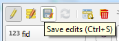

לחיצה על הדיסקט משאירה את מצב העריכה, אבל שומרת את השינויים שהתבצעו בשכבה עד כה

לחיצה שנית על העיפרון מקפיצה דיאלוג ששואל האם לשמור על השינויים.

## ידנית - הוספת שורה

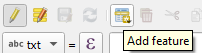

ומילוי הערכים החסרים.

מזהיר! השימוש לא מומלץ מכיוון שבהוספת שורה לא מוסיפים גאומטריה. המצב הפוך בהוספת גאומטריה - לאחר סיום שרטוט הגאומטריה, התוכנה שואלת לגבי ערכי יתר השדות. בחרו באפשרות זו רק במקרים מיוחדים שדורשים מילוי דאטה לפני הוספת גאומטריות.

## ידנית - הוספת עמודה

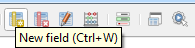

לאחר הלחיצה על הכפתור יפתח דיאלוג שישאל לגבי שם השדה, , הערה - אין צורך למלא וסוג המשתנה (טקסט,מספר שלם, מספר עם נקודה עשרונית, תאריך וכו')

לאחר שהוספנו את העמודה אנו יכולים למלא ערכים בצורה ידנית.

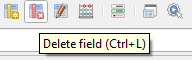

לחיצה על הכפתור האדום מאפשרת מחיקת שדות. אני ממליץ לא למחוק שום דבר - זה לא יעלה לכם במקום, אלא אם כן זה מבלבל, ואז כדאי למחוק.

## ידנית - שינוי ערכים בשורה

ניתן גם לבצע עריכות מרובות בעמודה אחת בצורה ידנית.

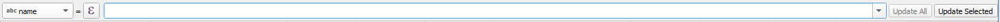

מצד שמאל בוחרים את השדה שרוצים לשנות, בצד ימין בוחרים את הערך. ניתן גם לבצע משהו בדומה לחישובי אקסל, ועל כך בהמשך.

שימו לב שבערכים טקסטואליים, צריך להקיף את הערך הרצוי בגרש בודד מכל צד.

לאחר שהקלדנו את הערך, נבחר בצד ימין באחת משתי אפשרויות - עדכון כל הישויות, או עדכון הישויות הנבחרות (במידה ובחרתם)

## אוטומטית - מחשבון שדות

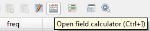

ניתן ללחוץ על הכפתור גם לא במצב עריכה

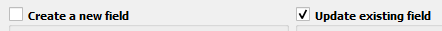

הבחירה המרכזית הראשונה היא האם להוסיף שדה חדש או לעדכן שדה קיים. עדיף להוסיף שדה חדש, זה לא עולה לכם כסף (אם כי זה קצת מבלבל)

בעדכון שדה קיים, תצטרכו בדרופדאון לקבוע איזה שדה אתם רוצים לעדכן. ביצירת שדה חדש, תצטרכו לקבוע את שם השדה וסוג המשתנה.

במידה ויש ישויות בחורות, ניתן לעדכן/להוסיף רק אותן - טיקבוקס בראש הדיאלוג.

כעת, ניתן לבצע חישוב באמצעות מנוע הביטויים או פייתון. לא נלמד בקורס הזה פייתון, אבל נלמד ממש קצת את מנוע הביטויים

## מנוע הביטויים 

מנוע הביטויים הוא כלי חזק מאוד, שהשימוש בו מתבצע בחלקים מרובים של התוכנה. חישוב שדות זה רק מקום אחד. השימוש בו מזכיר מאוד פונקציות אקסל.


ניתן לחפש פונקציות שונות בשורת החיפוש למעלה, אחרת - אפשר לדפדף בפונקציות השונות, הם מסווגות לפי קטגוריות.

קטגוריות חשובות:

fields and values - מכילה את כל השדות בשכבה. במידה ואנחנו רוצים לבצע חישוב שמבוסס על השדות האלו, אנחנו צריכים לעשות דאבל קליק על השכבה/שכבות הרצויות (שימו לב - הם יוקפו במרכאות כפולות. לא למחוק את המרכאות)

בקטגורית geometry יש ערכים שמתחיל עם סימן של דולר, אלו הם ערכים של השדה, כמו שטח, אורך הקיף או קוארדינטה. יש שם גם את הגאומטריה עצמה, ולמעשה אפשר לבצע פונקציות מרחביות כמו באפר (אבל על כך בהמשך)

יש אפשרות לבצע ממוצע, חציון וכו על עמודות ולהוסיף זאת לטבלה, הפונקציות האלה נמצאות בקטגורית aggragates.

בconditionals יש את if

כמו כן חשוב לבדוק את math וstring, יש שם ביטויים שעוזרים עם פונקציות מתמטיות ומחרוזת טקסט.

כמו כן ניתן להוסיף פעולות חשבוניות

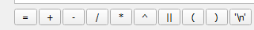

ניתן גם לבחון אם הביטוי שלכם עובד -

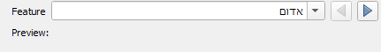

הדרופדאון ליד פיצ'ר מאפשר לבחור שדה בטבלה, והתוצאה לשדה הספציפי הזה תוצג ליד preview. אפשר לעבור בין שדות עם החיצים.

בצד ימין מופיעה דוקומנטציה עבור כל פונקציה, מומלץ מאוד להיעזר בה.

ניתן לבצע דברים מורכבים בהרבה עם מנוע הביטויים, טרם הצלחתי לצלול לתוכו במידת הצורך, אבל יתכן שזה מחוץ לגבולות הקורס.


## תרגיל ראשון:

```{r echo=FALSE}
download_file("lesson_3.gpkg",button_label = "להורדת הקובץ")
```

פתחו את שכבת קווי הרכבות הקלות מהשיעור הקודם

שנו את השדה בו היעד הוא הר הרצל ליד ושם

הוסיפו שדה לבחירתכם, ומלאו בו ערכים

הפכו את כל שמות כל הישויות של הקווים הסגולים לורודים(לא בעריכות בודדות אלא בעריכה אחת, למדנו שתי דרכים לעשות זאת)

חשבו את ההפרש בין אורך הישויות לבין ממוצע אורכי כל הישויות.


## אתנחתא/השלמת חוב - סרגל התוויות

היחידה הזאת רלוונטית כאן, כי אנחנו הולכים "להזיז" דברים בצורה גרפית.

אנחנו זוכרים איך לייצר תווית, עכשיו ניתן גם להזיז אותה בצורה פרטנית:

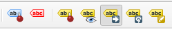

מימין לשמאל:

הכפתור מאפשר לבחור תווית, ולשנות את ערכה. בשימוש ראשוני, הוא ישאל לגבי העמודה שהיא המזהה היחודית של השורות. לרוב זה יהיה fid.

ניתן שם לשנות את העיצוב של התווית בצורה פרטנית

הכפתור של תווית עם חץ ישר מאפשר להזיז את התווית למקום אחר

הכפתור של תווית עם חץ מעוגל מאפשר לשנות את הזווית של הטקסט

הכפתור עם העין - להחביא את התווית או להחזיר אותה למצב נראות (החזרה לנראות - לחיצה על הישות עצמה)

הכפתור עם הסיכה מקבע תווית שלוחצים עליה למקום אחד- היא לא תזוז עם הזום ותמיד תהיה גלוה

הכפתור האדום יאפשר לראות תוויות שלא יוצגו כי הן חופפות.

הכפתור הכחול יאפשר לראות תגיות קבועות במקום.


## עריכה גאומטרית (דיגיטציה)

כעת נעבור לשאלה- איך בכלל אנחנו מייצרים שכבה גאוגרפית?

טבלה זה קל לייצר, פותחים אקסל ומתחילים לתקתק שמות עמודות וערכים.

אבל איך מייצרים שכבה? איך מייצרים את הגאומטריות שבה?

## יצירת שכבה יש מאין

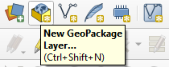

הדיאלוג מאפשר לציין את קובץ הגאופקג' (יווצר חדש עם שם לבחירתכם אם לא בחרתם בקיים), שם הטבלה, סוג הגאומטריה, מערכת הקואורדינטות, וכלי להוספת שדות. כדאי להוסיף לפחות שדה אחד בהתחלה(כמו במחשבון השדות), בשביל לזהות יותר בקלות את הישויות. יווצר אוטומטית שדה fid שימספר את הישויות.

ואם בשייפפייל חפצה נפשכם

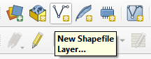

קלט מאוד דומה לגאופקג'.

לאחר שיצרנו את השכבה, ניתן לערוך אותה עם כפתור העיפרון. כרגע השכבה ריקה, לא לעוד זמן רב.

## בסיס - סרגל כלים עריכה

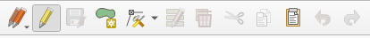

הצורה הירוקה מאפשרת להתחיל לסרטט ישות חדשה. היא בלוגו שונה עבור נקודות וקווים, אבל לכולם יש גוון של ירוק.

במידה ומדובר בנקודה, לאחר שלחצנו היכן שאנחנו מעוניינים שהנקודה תהיה, יפתח דיאלוג ששואל לגבי ערכי יתר השדות בטבלה.

במידה ומדובר בקו, יופיע קו מקווקו דק לאן שנמשוך את העכבר. לחיצה על כפתור ימני תוסיף עוד נקודה, וכן הלאה. לחיצה על הכפתור השמאלי תסגור את הצורה ותפתח את דיאלוג הערכים.

פוליגון זהה לקו בהקשר הזה, למעט העובד שלחיצה על הכפתור הימני תחבר את הנקודה הנוכחי עם הנקודה ההתחלתית.

## פאנל ורטקס

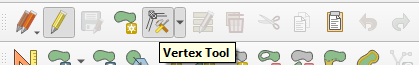

כלי שפותח פאנל בו נמצאים הערכים המספרים של הקואורדינטות של ישות (במידה ולחצנו על הישות עם כפתור ימני), וגם מאפשר להזיז את קווי המתאר שלה, ולהוסיף נקודות נוספות.

הזזה של קווי המתאר (נקודה או קו של הצורה) מתאפשר על ידי לחיצה אחת על הנקודה/קו שרוצים להזיז, הזז, ולחיצה שניה.

ניתן גם להוסיף נקודה נוספת באמצע או סוף קו. באמצע קו - פשוט לרחף מעל הקו וללחוץ על ה+ שמופיע במרכז הקו, בסוף קו - ללחוץ על הפלוס שמופיע בסמוך לנקודה.

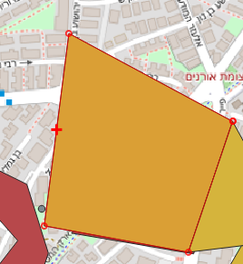


לחיצה על delete עבור נקודה או קו בחורים ימחוק אותם.

חשוב לציין - ניתן לשנות את הקואורדינטות ידנית בטבלה של הפאנל ורטקס.

## תרגיל שני:

יצרו שכבה

העלו ברקע את הopen street map

ציירו את משרדי ארא


## סרגל כלים עריכה מתקדמת

פאנל עריכה מתקדמת מאפשר כלים מתקדמים לעריכה, אבל לא רק.

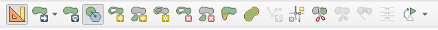

בראש ובראשונה הוא מאפשר גישה אל פאנל עריכה מתקדמת (סרגל המידה), כלי שימושי מאוד עליו נדון בשקף הבא

מעבר לכך, הוא מאפשר להזיז צורה או לשכפלה ולהזיזי, לסובב אותה, לפשט את קווי המתאר שלה, לייצא בה חור, להוסיף לה חלקים (במידה ומדבור במולטי-צורה), לייצר ישויות מעליה, למלא את החורים שקיימים בה, למחוק חלקים שלה (במידה ומדובר במולטי צורה), לשנות את הצורה (לא מומלץ, עדיף עם פאנל ורקטס), לעשות לה סוג של באפר ידני, להפוך את כיוון הקו, לחבר קו לקו בצורה אוטומטית, לפרק צורה לשניים, לפרק מולטי צורה לחלקים, לחבר בין חלקים ובין הערכים שלהם, לסובב סמל תגית של נקודה.

## פאנל עריכה מתקדמת

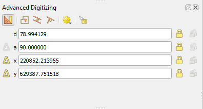

פאנל העריכה המתקדמת מאפשר יכולות cad לשרטוט, כמו - הגבלת מרחק, זווית או קואורדינטה, תוך כדי רפרנס לניצבות או מקבילות מישויות אחרות. לא יודע להשוות אותו לcad אחר, אבל הוא עושה עבודה לא רעה בכלל.

## סרגל כלים צורות

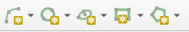

בסרגל הצורות ניתן להיעזר בצורות מוכנות מראש כמו עקום, מעגל, אליפסה, מלבן או פוליגון. את כל הצורות ניתן להוסיף בצורה מותאמת ומספרית.

## סרגל כלים snapping

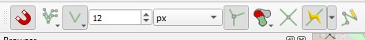

סרגל כלים snaping מאפשר הצמדה מסוגים שונים כשעורכים ישויות.

ניתן לבחור אם ההצמדה היא לכל השכבות או לשכבת העבודה בלבד,

ניתן לבחור שההצמדה תהיה רק לנקודות או גם לקווים, שטחים, צנטרואידים ואמצעי קטעים,

ניתן לבחור את יחידת המידה ממנה ההצמדה תעבוד- פיקסלים או יחידת המידה של המפה,

עריכה טופולוגית מאפשרת שינוי בגאומטריה של מספר ישויות גובלות.

ניתן למנוע חפיפה של הדיגיטיציה,

ניתן להצמיד להצטלבויות של שכבות או ישויות, גם אם אין שם נקודה

ניתן לעשות tracing שהיא דיגיטציה אוטומטית לאורך צורה קיימת

## תרגיל שלישי:

בתוך משרדי ארא, ייצרו פוליגון שרחוק בדיוק 4 מטרים מקווי הבניין.


## נספח - ייצוא וייבוא לקאד

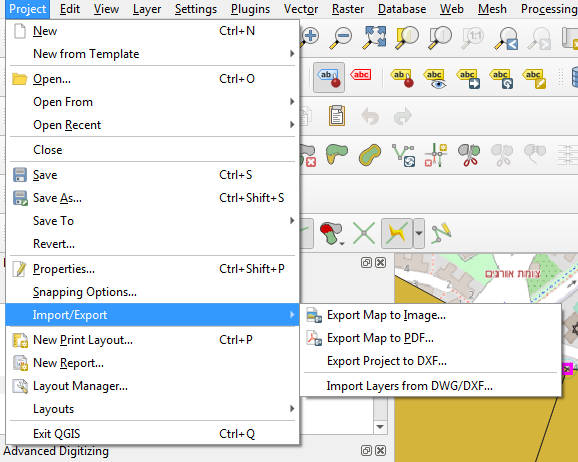

יש שם הרבה אפשרויות, אני לא עובד עם קאד, ולכן שווה לבדוק את היכולת לייצא ולייבא.

## סיכום

עולם הדיגיטציה בqgis מלא בכל טוב. אינני מכיר לעומק תוכנות קאד אבל יש לי תחושה שqgis נותנת מענה ללא מעט צרכי קאד.


<link href="my-style.css" rel="stylesheet">